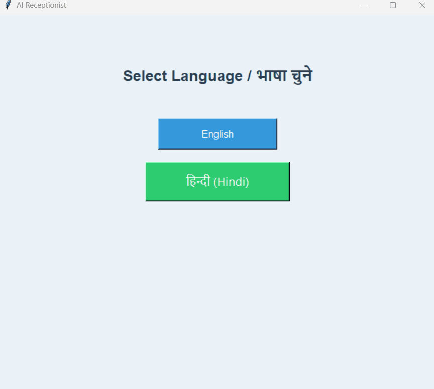

# 🏥 AI-Powered Hospital Receptionist GUI

A feature-rich desktop application built with Python and Tkinter that simulates and streamlines the patient journey in a hospital, from language selection and appointment booking to patient check-in and lab test selection.

## ✨ Live Demo



## 📖 Application Flow

The demo above showcases the primary user journey through the application:

1.  **Language Selection:** The application starts by offering a choice between **English** and **Hindi**. This choice dictates the language for the entire user interface.
2.  **Welcome Screen:** The main hub for navigation. From here, a user can choose to book a new appointment, handle an emergency, select a lab test, or check in for an existing appointment.
3.  **Back Navigation:** A back arrow on the Welcome Screen allows the user to return to the language selection screen at any time without restarting the application.
4.  **Specialty Selection:** When booking an appointment, the user first chooses a medical specialty (e.g., Cardiology, Orthopedics).
5.  **Doctor Selection:** The application displays a list of available doctors for the chosen specialty, showing their name, qualifications, availability status, and consultation fees in the selected language.
6.  **Appointment Booking:** The user selects a doctor and proceeds to a booking form to enter their name, phone, age, and gender.
7.  **Live Photo Capture:** Using **OpenCV**, the application activates the system's webcam, allowing the user to capture a live photo for their patient profile.
8.  **Booking Confirmation:** After filling out the form and capturing a photo, the user confirms the booking and payment, completing the appointment process.

## ⭐ Key Features

- **🌐 Dynamic Multi-Language Support:** Seamlessly switch between **English** and **Hindi**. All UI elements, including dynamically generated content, are translated instantly.
- **👨‍⚕️ Doctor & Specialty Selection:** Browse doctors categorized by medical specialty with detailed profiles including qualifications, timings, and consultation fees.
- **📸 Live Patient Photo Capture:** Integrates with the system's webcam using **OpenCV** to capture a patient's photo during registration.
- **🧪 Lab Test Selection with Cart:** A comprehensive menu of lab tests and packages with a dynamic cart system to track costs.
- **🚶‍♂️ Existing Patient Check-in:** A dedicated screen for returning patients to quickly find their doctor and notify them of their arrival.
- **🚨 Emergency Alarm:** A one-touch emergency button that plays an audible alarm sound using the `simpleaudio` library.

## 🛠️ Tech Stack

- **Core Language:** Python 3
- **GUI Framework:** Tkinter
- **Image Processing:** Pillow (PIL)
- **Camera Integration:** OpenCV
- **Audio Playback:** simpleaudio
- **Version Control:** Git & GitHub

## 🚀 How to Run Locally

1.  **Clone the repository:**
    ```bash
    git clone https://github.com/aagamCodeCraft/AI-Receptionist.git
    ```
2.  **Navigate to the project directory:**
    ```bash
    cd AI-Receptionist
    ```
3.  **Install dependencies:**
    ```bash
    pip install -r requirements.txt
    ```
4.  **Run the application:**
    ```bash
    python main.py
    ```